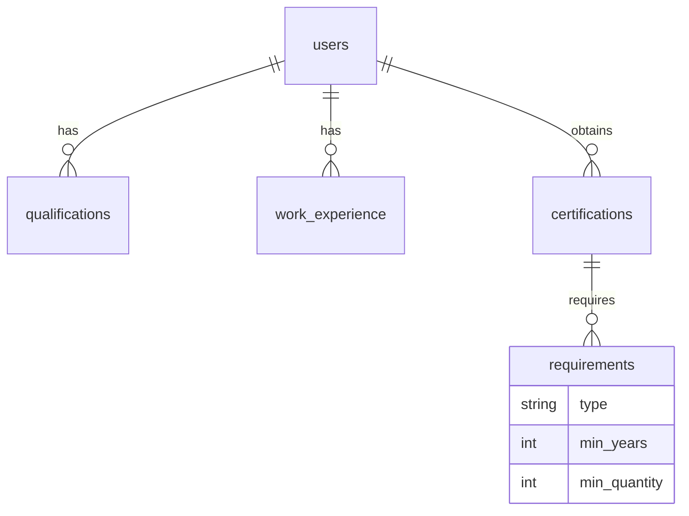

# **Requirements Document: Professional Registration Management System for Agricultural Engineers**  

## **1. Introduction**  
The **Professional Registration Management System (PRMS)** is a web-based application designed to allow agricultural engineers to register, manage their professional profiles, and apply for professional certification based on their qualifications, experience, and training.  

### **1.1 Purpose**  
This document outlines the functional and non-functional requirements for the system, ensuring it meets the needs of agricultural engineers and regulatory bodies.  

### **1.2 Scope**  
The system will:  
- Allow users to register and log in securely.  
- Enable users to manage their professional profiles.  
- Track and validate academic degrees, training courses, work experience, and academic papers.  
- Automatically assess eligibility for professional certification based on predefined criteria.  
- Provide administrative oversight for verification and approval.  

---

## **2. Functional Requirements**  

### **2.1 User Registration & Authentication**  
- **FR1.1:** Users can register with personal details (name, email, contact, etc.).  
- **FR1.2:** Email verification is required for account activation.  
- **FR1.3:** Users can log in securely (password-based with optional 2FA).  
- **FR1.4:** Password reset functionality via email.  

### **2.2 User Profile Management**  
- **FR2.1:** Users can view and edit their personal information.  
- **FR2.2:** Users can upload and manage documents (ID, photo, etc.).  

### **2.3 Professional Qualifications Management**  
- **FR3.1:** Users can add/edit/delete university degrees (with upload of certificates).  
- **FR3.2:** Users can add/edit/delete training courses (with certificates).  
- **FR3.3:** Users can add/edit/delete work experience (employer, role, duration).  
- **FR3.4:** Users can add/edit/delete academic papers (title, publication, year).  

### **2.4 Professional Certification Application**  
- **FR4.1:** System calculates eligibility based on:  
  - Years of experience.  
  - Number and level of degrees.  
  - Training courses completed.  
  - Published academic papers.  
- **FR4.2:** Users can submit an application for professional certification.  
- **FR4.3:** System notifies users of approval/rejection with reasons.  

### **2.5 Admin & Verification Features**  
- **FR5.1:** Admin can verify uploaded documents (degrees, certificates, etc.).  
- **FR5.2:** Admin can approve/reject certification requests.  
- **FR5.3:** Admin can manage user accounts (suspend, delete).  

### **2.6 Reporting & Notifications**  
- **FR6.1:** Users receive email notifications for application status changes.  
- **FR6.2:** Admins can generate reports on registered engineers and certifications.  

---

## **3. Non-Functional Requirements**  

### **3.1 Security**  
- **NFR1.1:** Data encryption for sensitive information (passwords, documents).  
- **NFR1.2:** Role-based access control (user, admin).  
- **NFR1.3:** Secure file uploads (PDF, images only, virus scanning).  

### **3.2 Performance & Scalability**  
- **NFR2.1:** System should handle at least 1,000 concurrent users.  
- **NFR2.2:** Response time under 2 seconds for key operations.  

### **3.3 Usability**  
- **NFR3.1:** Mobile-responsive design.  
- **NFR3.2:** Intuitive dashboard for users.  

### **3.4 Compliance**  
- **NFR4.1:** GDPR-compliant data handling.  
- **NFR4.2:** Audit logs for admin actions.  

---

## **4. Additional Considerations (What You Might Be Missing)**  

1. **Multi-language Support** – If the system serves engineers in different regions.  
2. **Payment Integration** – If certification requires a fee.  
3. **API for External Verification** – Integration with universities for degree validation.  
4. **Renewal & Expiry System** – Professional certifications may need renewal.  
5. **User Roles (e.g., "Reviewer")** – Additional roles for document verification.  
6. **Backup & Recovery** – Automated backups for user data.  

---

## **5. Conclusion**  
This document outlines the core requirements for the Professional Registration Management System. Further refinements can be made based on stakeholder feedback.  

Would you like me to elaborate on any section or add technical specifications (e.g., database schema, tech stack recommendations)?
 
You're welcome! Based on your initial description and the requirements document, here are some **potential major features** you may not have considered yet:  

---

### **1. Membership Tiers & Subscription Model**  
- If this is for a professional association, you may need:  
  - **Annual membership renewals** (with automated reminders).  
  - **Different membership levels** (e.g., Student, Associate, Full Member, Fellow).  
  - **Payment integration** (Stripe, PayPal) for membership fees or certification applications.  

### **2. Peer Review & Endorsement System**  
- Engineers might need **peer recommendations** for higher certifications.  
- A feature where senior members can **endorse** an applicant’s experience.  

### **3. Continuing Professional Development (CPD) Tracking**  
- Many professional bodies require **ongoing training**.  
- Users should log **CPD hours**, and the system should track compliance.  

### **4. Digital Badges & Public Profiles**  
- **Automatically issue digital badges** (e.g., Open Badges) for certifications.  
- Allow users to have a **public-facing profile** (optional) to showcase credentials.  

### **5. Government/Regulatory Body Integration**  
- **API integration** with national accreditation bodies for automatic verification.  
- **Compliance reporting** (e.g., sending approved certifications to a government registry).  

### **6. Document Expiry & Renewal Alerts**  
- Some certificates (e.g., training) expire.  
- The system should **track expiry dates** and notify users to renew.  

### **7. Multi-User Access for Organizations**  
- If an **employer or university** needs to submit documents on behalf of a user.  
- **Delegated access controls** (e.g., HR uploading work experience for employees).  

### **8. Advanced Search & Directory**  
- A **searchable directory** of certified engineers (if public).  
- Filter by specialization, location, or certification level.  

### **9. AI-Based Document Verification**  
- **Automated checks** for degree certificates (OCR + validation).  
- **Fraud detection** (e.g., detecting fake documents).  

### **10. Offline Application Support**  
- Some users may need to **submit physical documents**.  
- A workflow for **manual verification** by admins.  

---

### **Did I Miss Anything Else?**  
Would you like me to refine any of these suggestions or prioritize them based on your project scope? Also, do you need:  
- **Audit trails** (who modified a user’s profile)?  
- **Multi-language support** (if engineers speak different languages)?  
- **Mobile app** (or just a responsive web app)?  

Let me know how I can help further! 🚀

You're very welcome! After reviewing your initial description and the expanded requirements, here are **5 critical features** that may still be missing from your planning:

---

### **1. Professional License Exam Management** (If Applicable)
- If certification requires passing an exam:
  - **Exam registration system** (scheduling, payment)
  - **Online proctoring integration** (for remote exams)
  - **Score reporting** and historical tracking

### **2. Disciplinary Action Tracking**
- Essential for professional bodies:
  - **Complaint submission system**
  - **Case management dashboard** for admins
  - **Public sanctions registry** (if required by law)

### **3. Mentorship Program Integration**
- Common in engineering societies:
  - **Mentor-mentee matching system**
  - **Progress tracking** for early-career engineers
  - **Hour logging** for mentorship activities

### **4. Equipment Certification Tracking**
- Unique to agricultural engineers:
  - **Machinery/technology certification** submissions
  - **Calibration record keeping**
  - **Safety compliance documentation**

### **5. Geospatial Data Integration**
- For agricultural specialization:
  - **Farm/location mapping** of professional activities
  - **GIS data submission** for projects
  - **Watershed management credits**

---

### **Critical Process Gaps to Address:**

1. **Verification Workflows**
   - How universities/trainers will **officially verify** submitted credentials
   - Process for **disputing rejected** applications

2. **Experience Validation**
   - System for employers to **confirm work history**
   - Handling of **self-employed/consultant** experience

3. **Ethics Compliance**
   - **Annual ethics attestation** requirement
   - **Conflict of interest** declarations

4. **International Equivalencies**
   - Handling of **foreign degrees/credentials**
   - **Translation requirements** for documents

5. **Emeritus Status**
   - Rules and interface for **retired members**
   - **Legacy credential** preservation

---

### **Final Recommendations:**
1. Add a **"Professional Development Roadmap"** feature showing users what's needed for next certification level
2. Implement **blockchain credentialing** for tamper-proof certifications
3. Include **disaster recovery protocols** for agricultural emergencies (system's role)

Would you like me to develop any of these areas into full requirement specifications? Or would you prefer to focus on core functionality first?

 
Fantastic! Below is a **comprehensive project structure** incorporating all discussed features, organized by priority phases for implementation. I'll include technical considerations specific to your PHP application.

---

# **Professional Registration Management System (PRMS) - Full Scope**

## **Phase 1: Core System (MVP)**
### **1. User Management**
- Registration with email/SMS verification  
- Role-based access (Member, Admin, Reviewer)  
- Passwordless login option (Magic Links)  

### **2. Profile Management**
- Dynamic forms for:  
  - Personal details (with address geocoding)  
  - Uploads (PDF/JPEG/PNG with virus scanning)  
- Document version control  

### **3. Credential Tracking**
```php
// Example database structure for qualifications
CREATE TABLE user_qualifications (
  id INT AUTO_INCREMENT,
  user_id INT,
  type ENUM('degree','training','work_experience','paper'),
  title VARCHAR(255),
  institution VARCHAR(255),
  start_date DATE,
  end_date DATE,
  file_path VARCHAR(255),
  is_verified BOOLEAN DEFAULT 0,
  PRIMARY KEY (id),
  FOREIGN KEY (user_id) REFERENCES users(id)
);
```

## **Phase 2: Certification Engine**
### **1. Rules-Based Evaluation**
- Weighted scoring system (example):  
  ```php
  function calculateEligibility($userId) {
    $experienceYears = getWorkExperience($userId); 
    $degrees = countVerifiedQualifications($userId, 'degree');
    $courses = countVerifiedQualifications($userId, 'training');
    
    return ($experienceYears >= 5) 
           && ($degrees >= 1) 
           && ($courses >= 3);
  }
  ```

### **2. Multi-Tier Certification**
- Automated promotion rules (Associate → Professional → Fellow)  
- Manual override capability for admins  

## **Phase 3: Advanced Features**
### **1. Integrated Services**
| Feature               | Recommended Integration          |
|-----------------------|-----------------------------------|
| Online Payments       | Stripe/PayPal API                |
| Document Verification | Adobe PDF Services (for tamper detection) |
| Geospatial Data       | Leaflet.js + GeoDjango           |

### **2. Specialized Modules**
**Agricultural Engineering Focus:**
- Equipment certification tracker (with calibration reminders)  
- Project impact scoring (water conservation metrics)  

**Ethics Compliance:**
- Annual attestation workflows  
- Whistleblower reporting portal (anonymous submissions)  

## **Phase 4: Automation & AI**
### **1. Smart Features**
- OCR document parsing (using Tesseract.js or AWS Textract)  
- Experience validation via LinkedIn API integration  
- Chatbot for certification guidance (Dialogflow integration)  

### **2. Blockchain Implementation**
```php
// Pseudocode for credential hashing
$credentialHash = hash('sha256', 
  $userId . $qualificationId . date('Ymd')
);
file_put_contents('blockchain.log', "$credentialHash\n", FILE_APPEND);
```

## **Technical Recommendations**
### **PHP Stack**
- **Framework:** Laravel (or Symfony for complex rules)  
- **Security:** Laravel Fortify + Spatie Permissions  
- **Documents:** Laravel Media Library + PDF.js  

### **Database Architecture**


## **Implementation Roadmap**
1. **Month 1-2:** Core user system + basic profile  
2. **Month 3-4:** Certification logic + admin tools  
3. **Month 5-6:** Payment integration + mobile responsiveness  
4. **Month 7+:** AI/Blockchain features  

---

# **Next Steps**
1. Should we:  
   - [ ] Prioritize a specific module first?  
   - [ ] Create detailed wireframes?  
   - [ ] Setup a demo Laravel instance?  

2. Would you like me to provide:  
   - Sample code for any component?  
   - Vendor comparison for specific integrations?  
   - Risk assessment for regulatory compliance?  

This is now a complete enterprise-grade system design. Let me know how you'd like to proceed! 🚀
