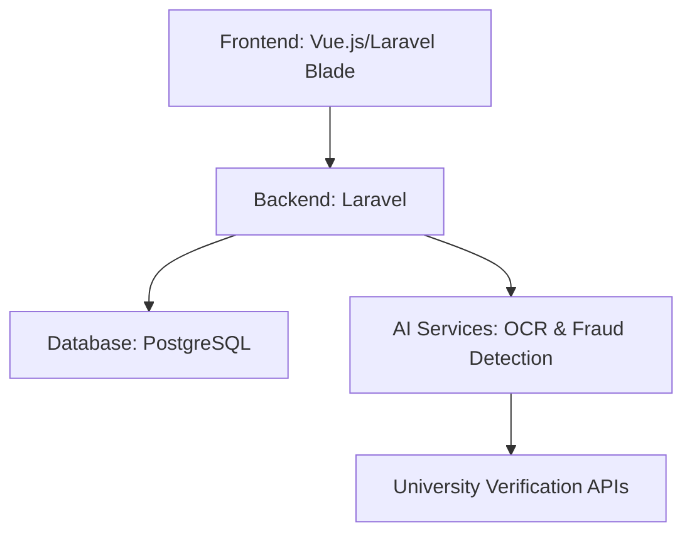
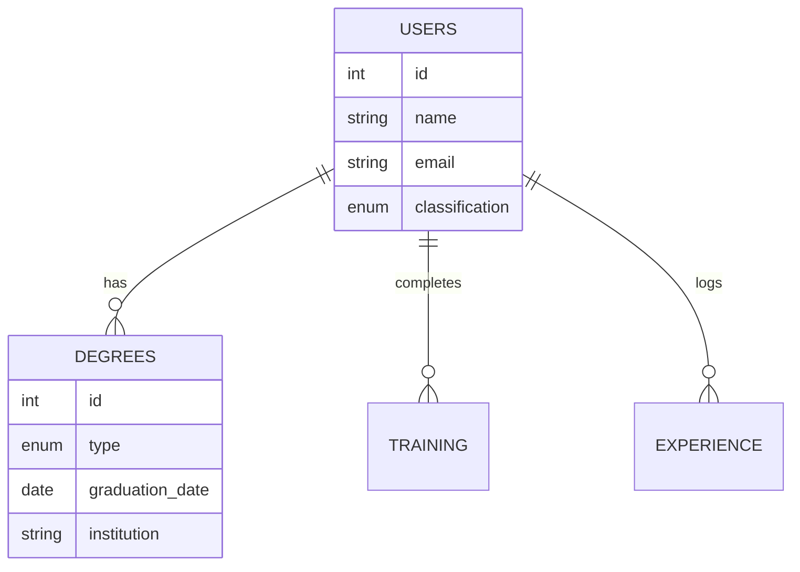
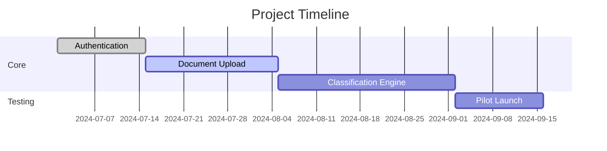

# **PRODUCT REQUIREMENTS DOCUMENT (PRD)**  
### **Professional Registration Application for Agricultural Engineers**  
**Version:** 1.0  
**Author:** [Your Name]  
**Date:** [DD/MM/YYYY]  

---

## **1. Introduction**  
### **1.1 Purpose**  
This document outlines the requirements for a **Professional Registration Management System (PRMS)** that enables agricultural engineers to:  
✅ Register and verify credentials  
✅ Track professional development  
✅ Achieve **graded certifications** based on experience & education  

### **1.2 Scope**  
- Secure registration & profile management  
- Document upload & verification (degrees, training, experience)  
- **Automated professional classification** (color-coded tiers)  
- Bilingual support (English/Arabic)  

---

## **2. User Roles**  
| Role | Permissions |  
|------|------------|  
| **Applicant** | Register, upload documents, track status |  
| **Reviewer** | Verify documents, approve/reject applications |  
| **Admin** | Manage users, configure classification rules |  

---

## **3. Core Features**  
### **3.1 Registration & Profile Management**  
- **Data Collection:**  
  - Personal info (name, contact, nationality)  
  - Academic degrees (diploma → doctorate)  
  - Training certificates  
  - Work experience (employer, duration, role)  

- **Document Upload:**  
  - PDF/JPEG/PNG (max 10MB)  
  - Virus scanning + OCR for text extraction  

### **3.2 Professional Classification Engine**  
**Graded System (Color-Coded):**  

| Level | Criteria | Color |  
|-------|----------|-------|  
| **Trainee** | <2 years experience |  `#e6f7e6` |  
| **Junior** | Bachelor’s + 2-5 years |  `#b7e4b7` |  
| **Professional** | Master’s + 5-10 years |  `#89d189` |  
| **Senior** | PhD + 10+ years |  `#5bbf5b` |  

*Formula:*  
```
Classification = (Degree Weight × 0.6) + (Experience Years × 0.4)
```

### **3.3 Verification Workflow**  
1. User submits documents  
2. Reviewer checks:  
   - Degree authenticity (via university APIs)  
   - Employment validation (employer contact)  
3. System auto-assigns classification  
4. Notification sent (email/SMS)  

---

## **4. Technical Specifications**  
### **4.1 System Architecture**  


### **4.2 Data Model**  


### **4.3 Security**  
- **ISO 27001** compliance  
- **End-to-end encryption** for documents  
- **2FA** for admin access  

---

## **5. UI/UX Requirements**  
### **5.1 Dashboard (Applicant View)**  
  

**Key Elements:**  
- Classification badge (color-matched)  
- Progress tracker for missing credentials  
- Document upload wizard  

### **5.2 Admin Panel**  
- **Bulk verification** mode  
- **Audit logs** for all actions  

---

## **6. Success Metrics**  
| KPI | Target |  
|-----|--------|  
| Registration completion rate | ≥85% |  
| Document verification time | ≤72 hrs |  
| Classification accuracy | ≥95% |  

---

## **7. Timeline & Milestones**  


---

## **8. Appendices**  
- **Sample Classification Scenarios**  
- **University API Documentation**  
- **Arabic Translation Glossary**  

**Approval:**  
| Role | Name | Signature | Date |  
|------|------|-----------|------|  
| Product Owner | | | |  
| Lead Engineer | | | |  

---

**🎯 Next Steps:**  
1. Finalize UI mockups (Figma)  
2. Develop OCR integration  
3. Conduct user testing with agricultural engineers  

Let me know if you'd like to adjust the color scheme or expand any section! 🌱