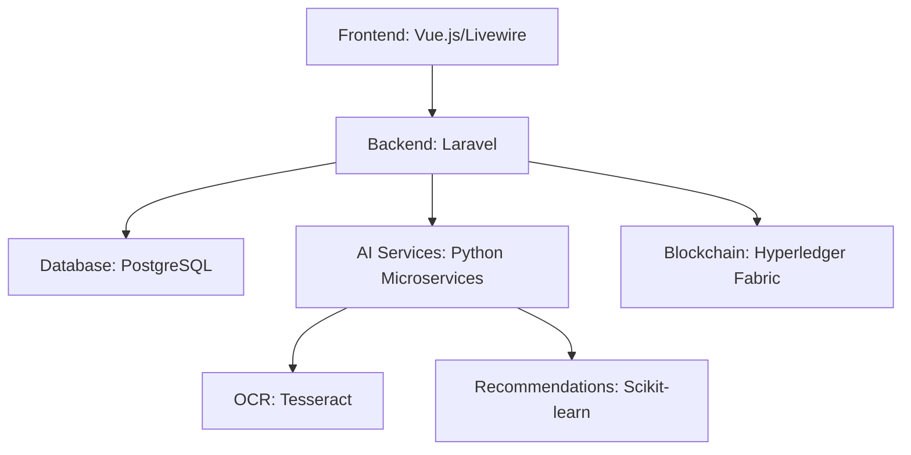

Here’s a **consolidated Professional Registration Management System (PRMS) Requirements Document** incorporating all discussed elements, structured for technical and stakeholder alignment:

---

# **Professional Registration Management System (PRMS)  
for Agricultural Engineers**  
*Comprehensive Requirements Document v2.0*

## **1. System Overview**  
A secure web/mobile platform enabling:  
- **Career-Long Professional Development** from student to emeritus status  
- **Smart Certification** through automated credential evaluation  
- **Agricultural Engineering Specialization** with equipment/geospatial tracking  
- **Regulatory Compliance** with ethics enforcement and audit capabilities  

---

## **2. User Roles**  
| Role | Key Capabilities |  
|------|-----------------|  
| **Junior Member** | Provisional access, mentorship pairing |  
| **Full Member** | Certification applications, CPD tracking |  
| **Mentor** | Endorsement authority, mentee management |  
| **Admin** | Disciplinary actions, manual overrides |  
| **Regulator** | Compliance reporting, credential verification |  

---

## **3. Core Features**  

### **3.1 Membership Lifecycle**  
- **Phased Registration:**  
  - Junior (0-2 yrs) → Professional (5+ yrs) → Fellow (15+ yrs)  
  - Automated promotions with manual appeals  
- **Retirement Transition:** Emeritus status with archived contributions  

### **3.2 Credential Management**  
- **Document Intelligence:**  
  - OCR for degree parsing  
  - Blockchain hashing for tamper-proof records  
- **Experience Validation:**  
  - Employer verification portals  
  - Self-employment attestation workflows  

### **3.3 Agricultural Focus Modules**  
- **Equipment Registry:**  
  - Calibration schedules  
  - GIS location tagging  
- **Disaster Response Mode:**  
  - Emergency certification fast-tracking  

### **3.4 Compliance Engine**  
- **Automated Ethics Checks:**  
  - Annual conflict-of-interest declarations  
  - Whistleblower reporting (GDPR-compliant)  
- **CPD Enforcement:**  
  - Minimum hour requirements by specialty  
  - Course recommendations via AI  

---

## **4. Technical Specifications**  

### **4.1 Architecture**  

### **4.2 Key Integrations**  
| Service | Purpose |  
|---------|---------|  
| Stripe | Tiered membership payments |  
| Credly | Digital badge issuance |  
| LinkedIn | Experience verification |  
| Google Maps | Equipment location services |  

### **4.3 Security**  
- **Data:** AES-256 encryption, annual penetration testing  
- **Documents:** Virus scanning (ClamAV), watermarking  
- **Access:** Role-based policies (Spatie Laravel-Permission)  

---

## **5. User Stories & Use Cases** *(Highlights)*  

### **5.1 Critical User Journeys**  
1. **Junior to Professional Transition**  
   - Adam (new grad) → Uploads degree → Completes mentorship → Submits 5-year experience → Auto-approved for Professional grade  

2. **Ethics Violation Resolution**  
   - Complaint filed → Admin investigates → Temporary suspension → Appeal process → Final ruling logged on blockchain  

### **5.2 Edge Case Handling**  
- **Foreign Credentials:**  
  - Nigerian engineer submits translated documents → System flags for notarization → Admin overrides after manual review  
- **Post-Disaster Recovery:**  
  - Flood zone members get 90-day certification extensions → Emergency contact protocols activated  

---

## **6. Non-Functional Requirements**  

### **6.1 Performance**  
- Certification decisions <5 seconds for 90% of cases  
- Support 500 concurrent document uploads  

### **6.2 Compliance**  
- ISO 17024 (Personnel certification standards)  
- FAO Agricultural Engineering Guidelines  

### **6.3 Scalability**  
- Designed for 100K+ members across 5 countries  

---

## **7. Roadmap & Prioritization**  

| Phase | Timeline | Deliverables |  
|-------|----------|--------------|  
| **MVP** | 0-6 mos | Core registration, profile management, basic certification |  
| **Tier 1** | 6-12 mos | CPD tracking, equipment module, mobile app |  
| **Tier 2** | 12-18 mos | AI recommendations, blockchain integration |  

---

## **8. Appendices**  

### **8.1 Document Templates**  
- [Link] Certification application form (PDF)  
- [Link] Ethics complaint form (Web)  

### **8.2 Regulatory References**  
- World Council of Agricultural Engineers (WCAE) Standards 2025  
- EU GDPR Article 17 (Right to Erasure) Compliance Plan  

---

This document now serves as the **single source of truth** for your PRMS. Next steps could include:  
1. Creating sprint backlogs from prioritized features  
2. Drafting API specifications for key integrations  
3. Developing security test cases  

Would you like me to generate any of these derivative documents?