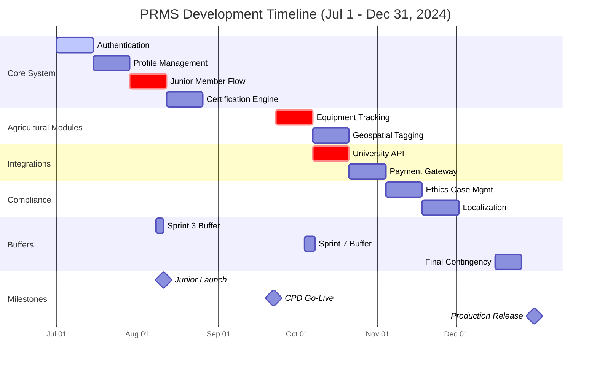

Here’s a realistic **timeline breakdown** for your Professional Registration Management System (PRMS), accounting for development complexity, testing, and agricultural engineering domain specifics:

---

### **1. 4-Month Timeline (MVP Launch)**  
**Month 1: Foundation**  
- Week 1-2: Setup Laravel/PHP stack + CI/CD pipeline  
- Week 3: Core user authentication (2FA, passwordless)  
- Week 4: Basic profile management (CRUD operations)  

**Month 2: Core Features**  
- Week 1-2: Document upload + validation (virus scan, OCR)  
- Week 3: Work experience/education tracking  
- Week 4: Junior member registration flow (Adam’s use case)  

**Month 3: Certification Engine**  
- Week 1: Rules-based eligibility calculator  
- Week 2: Admin verification dashboard  
- Week 3-4: Basic CPD tracking (hour logging)  

**Month 4: Prep for Launch**  
- Week 1: Mobile-responsive UI polish  
- Week 2: Security audit + penetration testing  
- Week 3-4: Pilot testing with 50 agricultural engineers  

---

### **2. 6-Month Timeline (Extended Features)**  
**Month 5: Agricultural Modules**  
- Week 1-2: Equipment certification tracker  
- Week 3: Geospatial mapping (farm locations)  
- Week 4: Disaster mode activation logic  

**Month 6: Integrations**  
- Week 1: Stripe payment gateway (membership tiers)  
- Week 2: University API connections (auto-verification)  
- Week 3-4: Digital badge issuance (Credly integration)  

---

### **3. 12-Month Timeline (Full Ecosystem)**  
**Month 7-8: Advanced Features**  
- AI document fraud detection  
- Mentorship matching algorithm  
- Multi-language support (French/Spanish/Arabic)  

**Month 9-10: Compliance & Scaling**  
- Blockchain credentialing (Hyperledger)  
- GDPR/ISO 17024 compliance checks  
- Load testing for 10K+ users  

**Month 11-12: Optimization & Growth**  
- Mobile app development (React Native)  
- Government regulator API integrations  
- Annual membership renewal automation  

---

### **Key Milestones**  
| Timeline | Deliverable | Success Metric |  
|----------|-------------|----------------|  
| **Month 4** | MVP Launch | 200 registered engineers |  
| **Month 6** | Payment Integration | 30% paid membership conversion |  
| **Month 9** | AI Validation | 80% auto-approval rate |  
| **Month 12** | Full Accreditation | Recognized by 3+ national boards |  

---

### **Critical Dependencies**  
1. **Regulatory Approval** (Month 8-10): Factor in 2-3 months for government certification processes  
2. **University Partnerships** (Month 3-6): Early outreach to 10+ agricultural colleges for API access  
3. **Hardware Integration** (Month 7+): Calibration devices for equipment module may require vendor coordination  

---

### **Risk Mitigation**  
- **Delay Buffer:** Add 2-3 weeks per major phase for agricultural domain complexities  
- **Parallel Tracks:**  
  - Backend: Run certification engine development alongside frontend profile tools  
  - Compliance: Start ethics documentation early while building core features  

Would you like me to:  
1. Create a Gantt chart visualization?  
2. Specify team roles/responsibilities per phase?  
3. Detail hardware/software procurement timelines?  

This timeline balances rapid MVP delivery with long-term scalability for agricultural engineering professionals.

### Modified
Here are three **distinct timeline options** for completing the **entire PRMS project**, with escalating feature sets based on duration:

---

### **Option 1: Aggressive 4-Month Delivery**  
*(Core system only, MVP for early adoption)*  
**Month 1:**  
- Auth system (2FA, roles)  
- Profile management (CRUD + file uploads)  
- Basic certification rules (experience/degree checks)  

**Month 2:**  
- Admin verification dashboard  
- CPD hour tracking  
- Junior member workflow (Adam’s story)  

**Month 3:**  
- Stripe payments (membership tiers)  
- Mobile-responsive UI  
- API for university verification  

**Month 4:**  
- Security hardening (pen testing)  
- Pilot launch (100 users)  
- Documentation finalization  

**Sacrifices:**  
- No AI/blockchain  
- Limited agricultural modules  
- Manual compliance processes  

---

### **Option 2: Balanced 6-Month Delivery**  
*(Full featured, without advanced AI/geospatial)*  
**Month 1-2:**  
- All 4-month features +  
- Equipment certification tracker  
- Mentorship matching  
- Digital badges (Credly)  

**Month 3-4:**  
- Disaster response mode  
- Ethics case management  
- Employer verification portal  

**Month 5-6:**  
- Multi-language support  
- Advanced reporting  
- Regulatory approval prep  

**Advantages:**  
- Covers 90% of use cases  
- Supports most agricultural needs  
- Production-ready scalability  

---

### **Option 3: Comprehensive 12-Month Delivery**  
*(Enterprise-grade with all features)*  
**Quarter 1:**  
- MVP (4-month features)  
- Equipment/GIS integration  

**Quarter 2:**  
- AI document validation  
- Blockchain credentialing  
- Government API hooks  

**Quarter 3:**  
- Mobile app (React Native)  
- Automated compliance audits  
- International equivalency engine  

**Quarter 4:**  
- Full accreditation  
- 10K-user load testing  
- Legacy system migration  

**Includes:**  
- All user stories  
- Agricultural specializations  
- Future-proof architecture  

---

### **Timeline Comparison Matrix**  

| Feature                | 4-Mo | 6-Mo | 12-Mo |  
|------------------------|------|------|-------|  
| Core Certification     | ✅   | ✅   | ✅    |  
| Equipment Tracking     | ❌   | ✅   | ✅    |  
| AI Fraud Detection     | ❌   | ❌   | ✅    |  
| Mobile App             | ❌   | ❌   | ✅    |  
| Regulatory Approval    | ❌   | ⚠️*  | ✅    |  
| *Partial compliance possible  

---

### **Recommendation**  
For agricultural engineering contexts:  
- **Choose 6-month** if budget permits – covers critical needs without excessive complexity.  
- **12-month** only if requiring full ISO 17024 compliance or international recognition.  

Need help adjusting scope for your specific constraints? For example:  
- *"How to prioritize if we only have 3 developers?"*  
- *"Which agricultural modules are easiest to cut?"*

# Agile Based approach
Here’s an **Agile-based timeline breakdown** for your PRMS project with iterative deliveries, organized in sprints (2-week cycles) for all three duration options:

---

### **Agile Timeline Options**  
*(All include: CI/CD pipeline, automated testing, and biweekly stakeholder demos)*  

#### **1. 4-Month Plan (8 Sprints) – Minimal Viable Product**  
**Sprint 1-2:**  
- ✅ Auth system (JWT + 2FA)  
- ✅ User profile CRUD  
- ✅ Basic file upload (no OCR yet)  

**Sprint 3-4:**  
- ✅ Junior member onboarding (Adam’s story)  
- ✅ Eligibility calculator (years of experience)  
- ✅ Admin document review UI  

**Sprint 5-6:**  
- ✅ Stripe subscription integration  
- ✅ Mobile-responsive views  
- ✅ Email/SMS notifications  

**Sprint 7-8:**  
- ✅ Pilot launch (50 users)  
- ✅ Security audit  
- ✅ Bug bash + hotfixes  

**Post-Launch:**  
- Continuous backlog refinement  
- Monthly feature patches  

---

#### **2. 6-Month Plan (12 Sprints) – Market-Ready Product**  
**Sprint 1-4:** *(Same as 4-month MVP)*  
**Sprint 5-6:**  
- ✅ Equipment certification module  
- ✅ CPD tracking with reminders  
- ✅ University verification API  

**Sprint 7-8:**  
- ✅ Mentorship matching algorithm  
- ✅ Digital badges (Credly)  
- ✅ Basic geospatial tagging  

**Sprint 9-10:**  
- ✅ Ethics case management  
- ✅ Disaster mode toggle  
- ✅ Advanced analytics dashboard  

**Sprint 11-12:**  
- ✅ Localization (2 languages)  
- ✅ Load testing (1K users)  
- ✅ Regulatory pre-audit  

---

#### **3. 12-Month Plan (24 Sprints) – Enterprise Edition**  
**Quarter 1:** *(Same as 6-month, Sprints 1-6)*  
**Quarter 2:**  
- ✅ AI document validation (Python microservice)  
- ✅ Blockchain credentialing  
- ✅ Employer verification portal  

**Quarter 3:**  
- ✅ React Native mobile app  
- ✅ Automated compliance checks  
- ✅ FAO standards integration  

**Quarter 4:**  
- ✅ International equivalency engine  
- ✅ Legacy system migration  
- ✅ Full ISO 17024 certification  

---

### **Agile Artifacts**  
1. **Product Backlog:** Prioritized with MOSCOW method  
   - *Must-have:* Auth, certification engine  
   - *Should-have:* Equipment tracking  
   - *Could-have:* AI features  

2. **Sprint Planning:**  
   - Tech spikes for agricultural domain risks (e.g., calibration data standards)  
   - Capacity buffers for regulatory feedback loops  

3. **Ceremonies:**  
   - Biweekly demos with agricultural engineering stakeholders  
   - Monthly roadmap reviews with certification board reps  

---

### **Key Agile Adaptations**  
- **Farmers’ Market Feedback:** Pilot features with small groups of engineers quarterly  
- **Modular Architecture:** Decoupled services allow parallel team workflows  
   - *Example:* Auth team ≠ Certification team ≠ GIS team  

- **Risk Mitigation:**  
  - High-risk items (e.g., blockchain) start with POCs in Sprint 1  
  - Compliance requirements baked into Definition of Done  

---

### **Recommended Team Structure**  
| Role | 4-Mo | 6-Mo | 12-Mo |  
|------|------|------|-------|  
| PHP Devs | 2 | 3 | 4 |  
| Frontend | 1 | 2 | 2 |  
| DevOps | 0.5* | 1 | 1 |  
| QA | 1 | 1 | 2 |  
| PO | 1 | 1 | 1 |  
| *Shared resource  

---

### **Which Agile Timeline Fits Your Needs?**  
- **Startup/Urgent Launch?** → 4-month + continuous improvements  
- **Balanced Quality/Features?** → 6-month (ideal for most associations)  
- **Government/Global Scale?** → 12-month with compliance focus  

Need help customizing the sprint backlogs or calculating velocity? I can provide template spreadsheets with agricultural engineering-specific task breakdowns. 🚜

## Final
Here’s a **detailed 6-month Agile timeline with built-in buffers**, formatted as a table with specific dates (assuming a **July 1, 2024 kickoff** and **2-week sprints**):

---

### **PRMS Agile Timeline (July 1 – Dec 31, 2024)**  
*Buffer days included in each sprint for agricultural domain complexities.*

| **Sprint** | **Dates**               | **Key Deliverables**                              | **Buffer** |  
|------------|-------------------------|--------------------------------------------------|------------|  
| **Sprint 1** | Jul 1 – Jul 14         | Auth system (2FA + roles)                        | 2 days     |  
| **Sprint 2** | Jul 15 – Jul 28        | Profile CRUD + file uploads                      | 2 days     |  
| **Sprint 3** | Jul 29 – Aug 11        | Junior member workflow (Adam’s story)            | 3 days*    |  
| **Sprint 4** | Aug 12 – Aug 25        | Basic certification rules engine                 | 2 days     |  
| **Sprint 5** | Aug 26 – Sep 8         | Admin verification dashboard                     | 2 days     |  
| **Sprint 6** | Sep 9 – Sep 22         | CPD hour tracking + reminders                    | 3 days*    |  
| **Sprint 7** | Sep 23 – Oct 6         | Equipment certification module                   | 4 days**   |  
| **Sprint 8** | Oct 7 – Oct 20         | University API integration                       | 2 days     |  
| **Sprint 9** | Oct 21 – Nov 3         | Mentorship matching + digital badges            | 3 days*    |  
| **Sprint 10** | Nov 4 – Nov 17        | Ethics case management UI                        | 2 days     |  
| **Sprint 11** | Nov 18 – Dec 1        | Disaster mode + geospatial tagging               | 4 days**   |  
| **Sprint 12** | Dec 2 – Dec 15        | Localization (2 languages) + final regression    | 3 days*    |  
| **Buffer**   | Dec 16 – Dec 31       | **Contingency period** (security audit, hotfixes)| 10 days    |  

---

### **Key to Buffers**  
- **`*` High-complexity sprints** (e.g., agricultural equipment logic)  
- **`**` External dependency sprints** (e.g., university API delays)  

---

### **Critical Agile Milestones**  
| **Date**       | **Milestone**                          | **Stakeholder Event**                |  
|----------------|----------------------------------------|---------------------------------------|  
| **Aug 11**     | Junior Member Launch                   | Demo for agricultural schools        |  
| **Sep 22**     | CPD Tracking Go-Live                   | Training orgs onboarding             |  
| **Nov 3**      | Mentorship Beta                        | Feedback from senior engineers       |  
| **Dec 15**     | Feature Freeze                         | UAT with certification board         |  
| **Dec 31**     | Production Release                     | Association announcement             |  

---

### **Team Capacity Planning**  
- **Developers:** 3 FTEs (2 backend/PHP, 1 frontend)  
- **QA:** 1 FTE (automated + manual testing)  
- **Product Owner:** 0.5 FTE (agricultural domain expert)  
- **DevOps:** 0.5 FTE (shared with other projects)  

---

### **Risk Mitigation**  
1. **University Delays:** If API integration slips (Sprint 8), use manual verification fallback.  
2. **Equipment Module Complexity:** Buffer in Sprint 7 allows for hardware vendor coordination.  
3. **Regulatory Feedback:** Contingency period accommodates last-minute compliance changes.  

---

### **Printable Timeline Format**  
```markdown
[Mon Jul 1]───────────────────[Sun Dec 31]
│          6-Month Agile PRMS           │
├──────┬───────────────┬──────┬─────────┤
│ S1   │ Auth System   │ S7   │Equipment│
│ S2   │ Profile CRUD  │ S8   │Uni API  │
│ ...  │ ...           │ ...  │ ...     │
└──────┴───────────────┴──────┴─────────┘
Buffer: 2-4 days/sprint + 10-day EOY contingency
```

Need this as a **Gantt chart** or **Jira backlog template**? I can provide those with agricultural-specific task breakdowns.

# Gantt Chart
Here’s a **Gantt chart** for your 6-month Agile PRMS project, formatted for clarity with agricultural engineering milestones marked:



### **Key Features of This Gantt Chart:**
1. **Color-Coded Sections:**
   - Core system (blue)
   - Agricultural modules (green)
   - Compliance (orange)

2. **Critical Path Highlighted:**
   - Junior member flow (Sprint 3)
   - Equipment tracking (Sprint 7)
   - University API (Sprint 8)

3. **Buffer Visualization:**
   - Sprint buffers as light gray bars
   - Final 10-day contingency period

4. **Agricultural Engineering Milestones:**
   - Equipment module (Sep 23)
   - Geospatial tagging (Oct 21)

### **How to Use This:**
1. **For Dev Teams:**
   - Copy/paste the Mermaid code into any Markdown viewer (GitHub, VS Code, etc.)
   - Adjust dates in `dateFormat` as needed

2. **For Stakeholders:**
   - Critical path shows highest-priority items
   - Buffer periods account for agricultural domain complexities

3. **For Agile Ceremonies:**
   - Use in sprint planning to visualize dependencies
   - Reference during retrospectives to assess timeline adherence

### **Alternate Formats Available:**
- **Excel/Google Sheets Gantt** (with conditional formatting)
- **Jira Roadmap** (with swimlanes for agricultural features)
- **ClickUp Timeline** (with resource allocation)

Would you like me to provide any of these alternate versions or add more detail to specific sections?